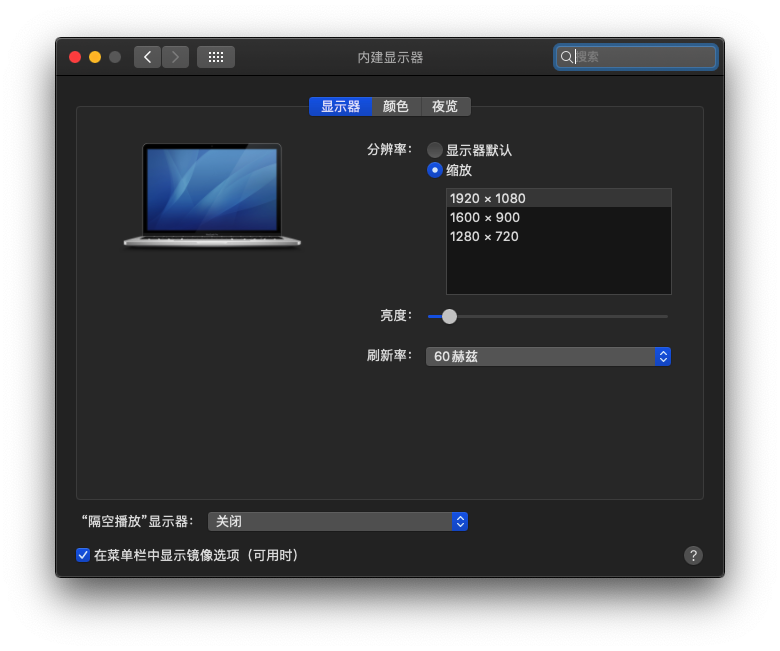
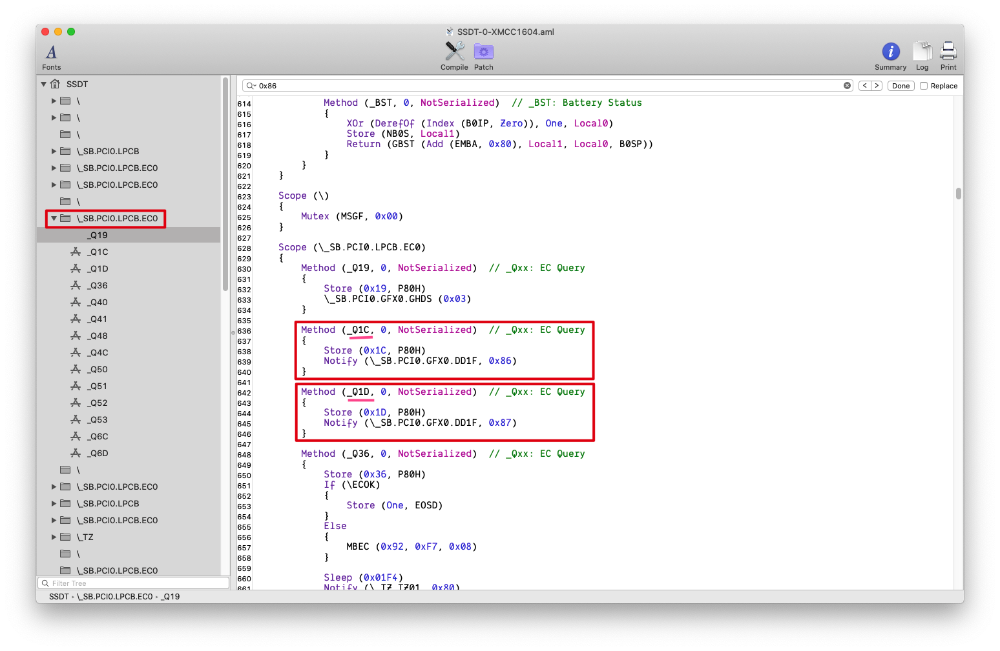
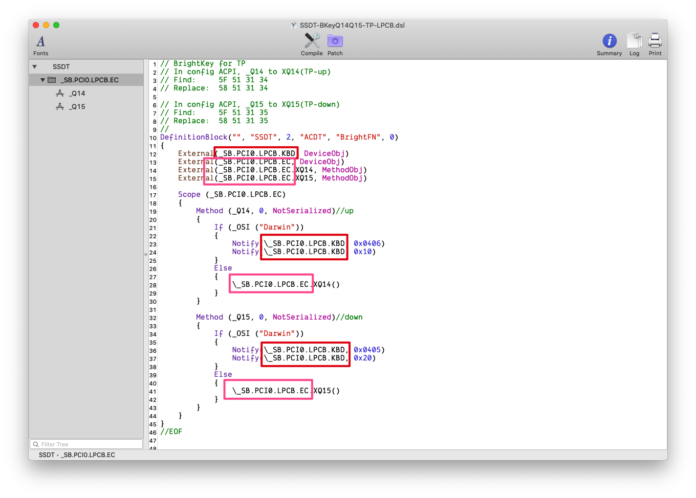
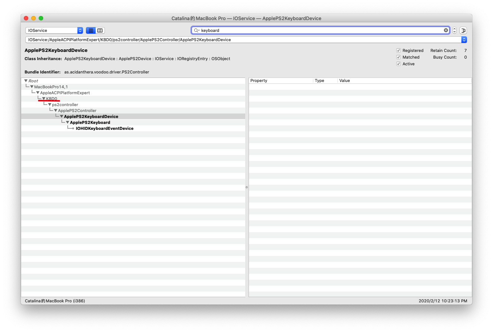
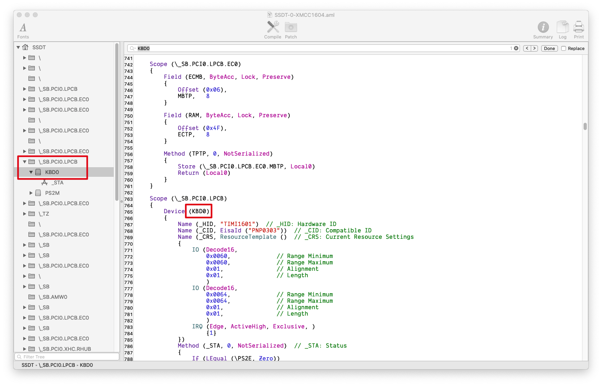
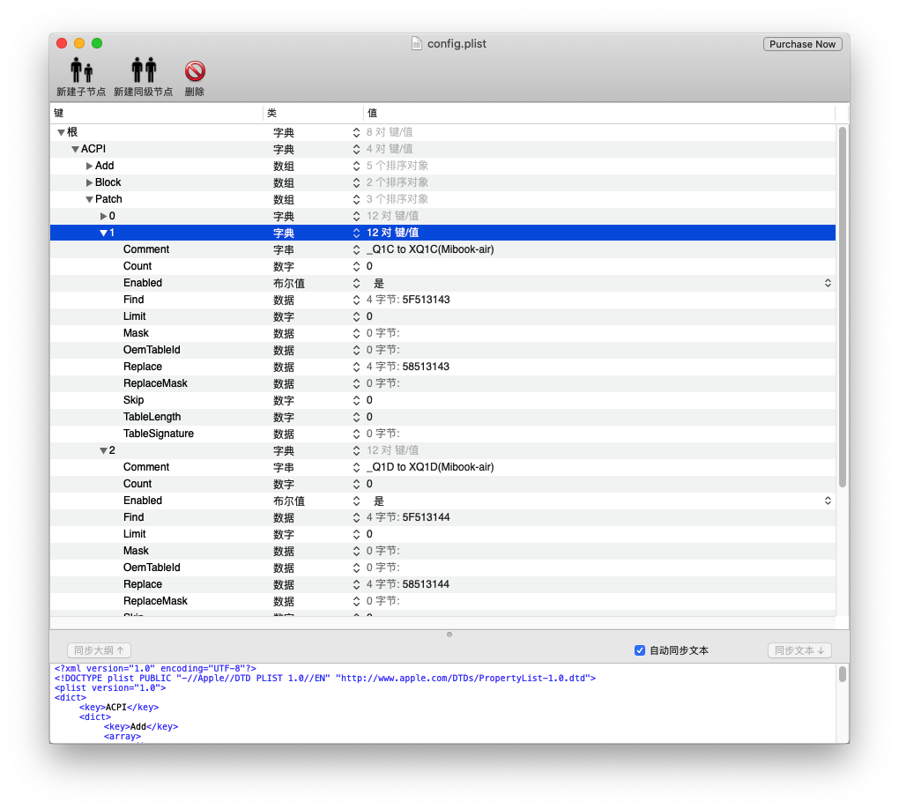

## 开启原生亮度调节快捷键
首先得确保你可以正常调节亮度, 在系统`偏好设置`-`显示器`🖥中可以看到亮度调节的滑块


然后, 你需要知道下面👇几个东西:

- 亮度调节调用的方法名, 在SSDT或者DSDT中搜索🔍: `0x86`

>一般情况下，亮度快捷键是 EC 的 _Qxx，这个 _Qxx 里包涵 Notify(***, 0x86) 和 Notify(***, 0x87) 指令。如果查找不到或者无法确认，搜索 ACPI，找到 Notify(***, 0x86) 和 Notify(*** 0x87) 所在位置。根据查询到的结果参照样本制作自己的补丁文件并进行正确的更名。

>Notify(***, 0x86) 对应 up 键，Notify(***, 0x87) 对应 down 键
参考自[OC-little](https://github.com/daliansky/OC-little/tree/master/17-%E4%BA%AE%E5%BA%A6%E5%BF%AB%E6%8D%B7%E9%94%AE%E8%A1%A5%E4%B8%81)

比如我的机器，我搜索`0x86`,结果是:
```dsl
        Method (_Q1C, 0, NotSerialized)  // _Qxx: EC Query
        {
            Store (0x1C, P80H)
            Notify (\_SB.PCI0.GFX0.DD1F, 0x86)
        }

        Method (_Q1D, 0, NotSerialized)  // _Qxx: EC Query
        {
            Store (0x1D, P80H)
            Notify (\_SB.PCI0.GFX0.DD1F, 0x87)
        }
```

注意左边的键盘⌨️设备路径: `_SB.PCI0.LPCB.EC0`, 同时我们知道`_Q1C`是亮度降低的方法名, `_Q1D`是亮度提高的方法名.

### 小例子🌰
```dsl
// BrightKey for TP
// In config ACPI, _Q14 to XQ14(TP-up)
// Find:     5F 51 31 34
// Replace:  58 51 31 34

// In config ACPI, _Q15 to XQ15(TP-down)
// Find:     5F 51 31 35
// Replace:  58 51 31 35
//
DefinitionBlock("", "SSDT", 2, "ACDT", "BrightFN", 0)
{
    External(_SB.PCI0.LPCB.KBD, DeviceObj)
    External(_SB.PCI0.LPCB.EC, DeviceObj)
    External(_SB.PCI0.LPCB.EC.XQ14, MethodObj)
    External(_SB.PCI0.LPCB.EC.XQ15, MethodObj)
    
    Scope (_SB.PCI0.LPCB.EC)
    {
        Method (_Q14, 0, NotSerialized)//up
        {
            If (_OSI ("Darwin"))
            {
                Notify(\_SB.PCI0.LPCB.KBD, 0x0406)
                Notify(\_SB.PCI0.LPCB.KBD, 0x10)
            }
            Else
            {
                \_SB.PCI0.LPCB.EC.XQ14()
            }
        }

        Method (_Q15, 0, NotSerialized)//down
        {
            If (_OSI ("Darwin"))
            {
                Notify(\_SB.PCI0.LPCB.KBD, 0x0405)
                Notify(\_SB.PCI0.LPCB.KBD, 0x20)
            }
            Else
            {
                \_SB.PCI0.LPCB.EC.XQ15()
            }
        }
    }
}
//EOF
```
[源码](https://github.com/daliansky/OC-little/blob/master/17-%E4%BA%AE%E5%BA%A6%E5%BF%AB%E6%8D%B7%E9%94%AE%E8%A1%A5%E4%B8%81/SSDT-BKeyQ14Q15-TP-LPCB.dsl)

这里我们有些需要修改的地方:


比如我想把`_Q1C`重命名为`XQ1C`, `_Q1D`重命名为`XQ1D`(随意,只要这个变量名没有被占用就好), 那么我需要将上面👆的例子中的`_Q14`全部替换成`_Q1C`,`XQ14`全部替换成`XQ1C`, 同理`_Q15`全部替换成`_Q1D`,`XQ15`全部替换成`XQ1D`. 接下来就是`EC`了, 你需要知道你的设备EC叫什么名字，你可以在`DSDT`和`SSDT`中搜索🔍`PNP0C09`
, 可以看到我的是`EC0`, 其实在上面的`_SB.PCI0.LPCB.EC0`我们也可以大概猜到是`EC0`. 将`_SB.PCI0.LPCB.EC`全部替换成`_SB.PCI0.LPCB.EC0`(最上面我们提到的设备路径). 

接下来就是确定键盘的型号了. 使用[IORegistryExplorer](IORegistryExplorer.zip)这个软件查看下键盘的型号


搜索`keyboard`, 可以看到我的键盘是`KBD0`, 为了验证这一点, 我们可以去`SSDT`或者`DSDT`中搜索`KBD0`


所以我们需要把上面的`_SB.PCI0.LPCB.KBD`全部替换成`_SB.PCI0.LPCB.KBD0`(不建议手动编辑，使用文本编辑器替换)

最后我们的dsl文件是这样的:
```dsl
// BrightKey for TP
// In config ACPI, _Q1C to XQ1C(TP-up)
// Find:     5F 51 31 34
// Replace:  58 51 31 34

// In config ACPI, _Q1D to XQ1D(TP-down)
// Find:     5F 51 31 35
// Replace:  58 51 31 35
//
DefinitionBlock("", "SSDT", 2, "ACDT", "BrightFN", 0)
{
    External(_SB.PCI0.LPCB.KBD0, DeviceObj)
    External(_SB.PCI0.LPCB.EC0, DeviceObj)
    External(_SB.PCI0.LPCB.EC0.XQ1C, MethodObj)
    External(_SB.PCI0.LPCB.EC0.XQ1D, MethodObj)
    
    Scope (_SB.PCI0.LPCB.EC0)
    {
        Method (_Q1C, 0, NotSerialized)//up
        {
            If (_OSI ("Darwin"))
            {
                Notify(\_SB.PCI0.LPCB.KBD0, 0x0406)
                Notify(\_SB.PCI0.LPCB.KBD0, 0x10)
            }
            Else
            {
                \_SB.PCI0.LPCB.EC0.XQ1C()
            }
        }

        Method (_Q1D, 0, NotSerialized)//down
        {
            If (_OSI ("Darwin"))
            {
                Notify(\_SB.PCI0.LPCB.KBD0, 0x0405)
                Notify(\_SB.PCI0.LPCB.KBD0, 0x20)
            }
            Else
            {
                \_SB.PCI0.LPCB.EC0.XQ1D()
            }
        }
    }
}
//EOF
```
接下来我们需要重命名:
```
_Q1C -> XQ1C
_Q1D -> XQ1D
```
我们需要把这4个字符串分别装换为16进制(可以在线搜索'字符串转16进制')

比如`_Q1C`装换为`16进制`就是*5F513143*
换种方式就是:
```code
Comment: Rename _Q1C to XQ1C
Find: 5F513143 
Replace: 58513143 
```
对于`_Q1D`同理. 也就是下面这个样子:


最后将上面的dsl保存为aml, 在配置文件中加载即可, 我们的原生亮度调节快捷键就可以正常工作了.
