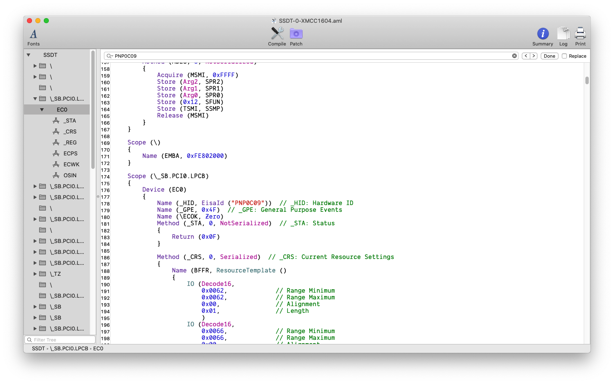

在`DSDT`或者`SSDT`里面搜索`PNP0C09`



在左边👈关联的是`EC0`,所以只需要对`EC0`重命名即可

```
comment: change EC0 to EC
find: 4543305F
replace: 45435F5F
```
另一种形式
```xml
				<dict>
					<key>Comment</key>
					<string>change EC0 to EC</string>
					<key>Disabled</key>
					<false/>
					<key>Find</key>
					<data>
					RUMwXw==
					</data>
					<key>Replace</key>
					<data>
					RUNfXw==
					</data>
				</dict>
```
可以删除DSDT-EC.aml了