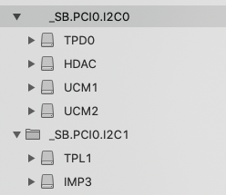

- GPIO

[GPIO Pin](https://voodooi2c.github.io/#GPIO%20Pinning/GPIO%20Pinning)

### 确定 设备的 ACPI ID 

1. 触摸板 - TPDX, ELAN, SYNA, CYPR (X是一个数字)
2. 触摸屏 - TPLX, ELAN, ETPD, SYNA, ATML
3. 传感器集合器 - SHUB

比如我的设备在DSDT中可以搜索🔍到: `TPD0` 和 `TPL1`, 但是我没有触摸屏, 所以我这里是`TPD0`



### 检查中断场景

打开`IORegExplorer`并搜索上一步找到的ACPI ID: `TPD0`

如果搜索的结果中没有`IOInterruptSpecifiers`, 那么就需要`Installing the kext`这一节
如果能找到, 展开这个节点, 记录下前两位数字, 在上面👆是`33`也就是`0x33`(这就是16进制的ACPI PIN), 如果
这个值小于等于`0x2F`, 那么同样可以跳过`Installing the kext`这一节.

你需要在DSDT中搜索ACPI ID(`TPD0`), 并且可以找到`Name`为`SBFB`

如果你的`ACPI PIN`大于`0x2F`, 继续下面👇的步骤

### 确保你的设备属于`GPIO-pinned`
 
#### 步骤 2a

你会来到这一节是因为苹果的驱动不支持`APIC` pins 大于`0x2F`(并且要让它们支持也非常困难), 在这种情况下
我们需要用到一个内核拓展`VoodooGPIO`, 这个内核拓展在`VoodooI2C`里面有, 它允许我们在苹果的限制下面使用
`GPIO`中断(大部分新的机器都支持)

我们首先的确认下你的设备是否已经配置好支持`GPIO pins`, 在DSDT中搜索你的ACPI ID. 找到`Name`为`SBFG`的代码
```dsl
            Name (SBFG, ResourceTemplate ()
            {
                GpioInt (Level, ActiveLow, ExclusiveAndWake, PullDefault, 0x0000,
                    "\\_SB.PCI0.GPI0", 0x00, ResourceConsumer, ,
                    )
                    {   // Pin list
                        0x0000
                    }
            })
```
这段代码应该位于设备的根下面👇或者`_CRS`方法下面, 前者我们说它属于`root pinned`, 后者我们
称为`CRS pinned`, 如果在`Pin list`下面的返回值非零, 我们加上一个前缀`well-`在之前的类型:
`well-root pinned`和`well-CRS pinned`, 如果你不能找到这段代码, 那么你的设备属于`unpinned`

如果你的设备属于`unpinned`, 前往步骤`2b`, 如果你的设备属于`pinned`但不属于`well-pinned`, 前往步骤`2c`
如果你的设备属于`well-pinned`, 前往步骤`2e`.

#### 步骤2c: 确保你的设备是`well-pinned`
即使放回的是`0x0`, 你的设备依旧有可能属于`well-pinned`, 下面有些方法来进一步确认.

在你的设备下面查找`_CRS`方法, 如果你能找到:

```dsl
Return (ConcatenateResTemplate (SBFB, SBFG))
```
说明你的设备属于`well-pinned`

> 警告⚠️: 上面那个和下面这个不一样

```dsl
Return (ConcatenateResTemplate (SBFB, SBFI))
```
你需要的是`SBFG`而不是`SBFI`

现在你可以确认你的设备类型, 如果你的设备是`well-pinned`, 前往步骤`2e`, 否则请前往步骤`2d`

#### 步骤2d: 手动Pinned你的设备

我们现在有一个严峻的任务, 给你的设备手动分配一个`GPIO Pin`, 使用上面的十六进制`GPIO Pin`
在右手边的一列找对应的`GPIO Pin`, 记录下左手边的`GPP_XYY_IRQ`

比如上面的`0x33`可以找到:
```
GPP_B3_IRQ
GPP_F3_IRQ
```

接下来根据找到的名称(不包含:`_IRQ`), 在下面寻找:

```
GPP_B3 27
GPP_F3 123
```
在上面右边的数字就是十进制的`GPIO Pin`将其装换为十六进制: 
```
27 -> 0x1B
123 -> 0x7B
``` 

将上面的一个个尝试, 如果上面的都不行(非常少的情况下), 使用一些公共的值:
`0x17`, `0x1B`, `0x34`, `0x55`

将得到的值替换`0x00`, 现在你的设备就是`well-pinned`, 可以查看步骤`2e`了

#### 步骤2e

在CSR方法中将返回值改为`Return (ConcatenateResTemplate (SBFB, SBFG))`