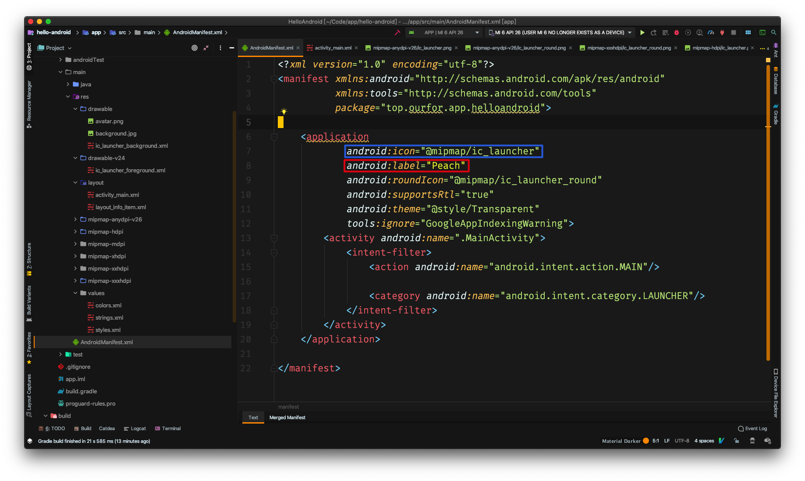
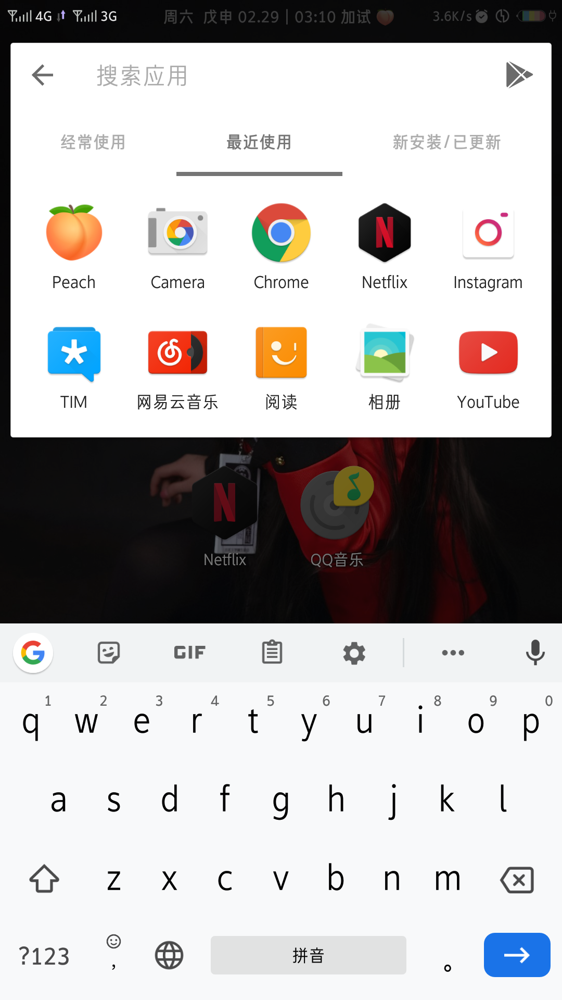

## 修改App名称和图标



在`AndroidMainifest.xml`中修改`Application`🏷的属性**android:label**的值即可, 其中`android:icon`指定应用程序图标, `android:roundIcon`指定圆角风格图标


## 布局

添加了FlexBoxLayout布局， 个人信息的每一项布局都是一样的, 代码如下:

```xml
    <com.google.android.flexbox.FlexboxLayout
            android:layout_width="match_parent"
            android:layout_height="wrap_content"
            app:alignItems="center"
            app:justifyContent="center">
        <TextView android:layout_width="wrap_content"
                  android:layout_height="wrap_content"
                  android:layout_marginEnd="10dp"
                  android:text="@string/student_id_tip"
                  android:textColor="#ffffff"
                  android:textSize="18sp"
                  app:layout_flexShrink="0" />
        <TextView android:layout_width="180dp"
                  android:layout_height="match_parent"
                  android:textColor="#ffffff"
                  android:text="@string/student_id"
                  android:textSize="18sp"
                  android:textAlignment="center" />
    </com.google.android.flexbox.FlexboxLayout>
```

启动类的代码如下:

```kotlin
package top.ourfor.app.helloandroid

import android.os.Bundle
import androidx.appcompat.app.AppCompatActivity

class MainActivity : AppCompatActivity() {

    override fun onCreate(savedInstanceState: Bundle?) {
        super.onCreate(savedInstanceState)
        setContentView(R.layout.activity_main)
    }

}
```


## 运行截图

图标修改成了🍑的图片, 程序名改成了`Peach`




程序内部截图

