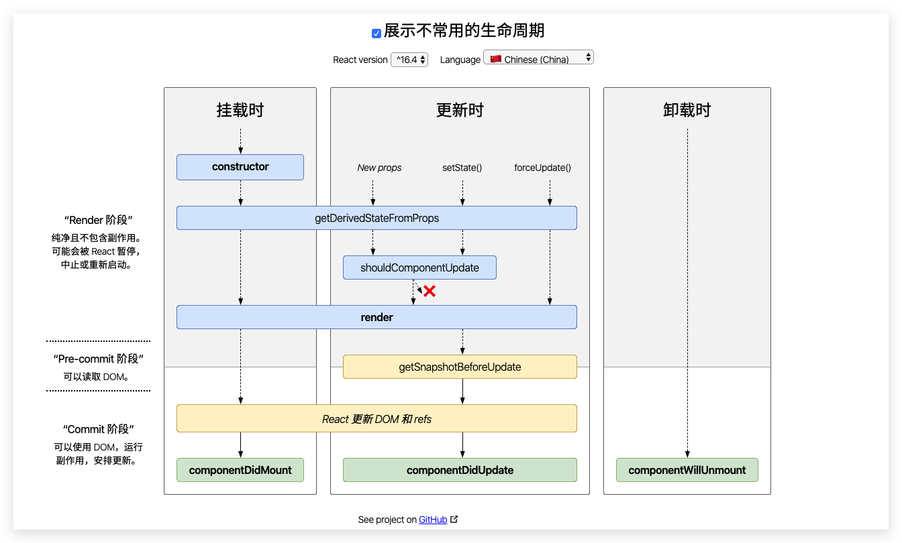
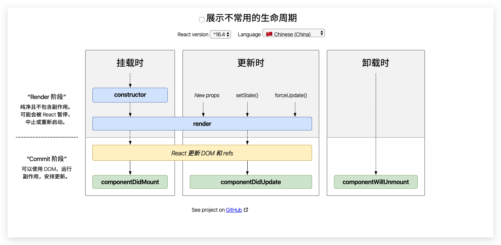

## [关于跨域](https://www.ruanyifeng.com/blog/2016/04/cors.html)

## [什么是Promise](https://juejin.im/post/5afd2ff26fb9a07aaa11786c)
js是异步单线程的, 基于事件驱动. js中回调嵌套过多, 代码就不太容易维护和修改, Promise是解决这个问题的方案之一.

[参考ES6](https://es.ourfor.top/#docs/promise)
Promise 是异步编程的一种解决方案，比传统的解决方案——回调函数和事件——更合理和更强大。它由社区最早提出和实现，ES6 将其写进了语言标准，统一了用法，原生提供了Promise对象。

所谓Promise，简单说就是一个容器，里面保存着某个未来才会结束的事件（通常是一个异步操作）的结果。从语法上说，Promise 是一个对象，从它可以获取异步操作的消息。Promise 提供统一的 API，各种异步操作都可以用同样的方法进行处理。

Promise对象有以下两个特点。

（1）对象的状态不受外界影响。Promise对象代表一个异步操作，有三种状态：pending（进行中）、fulfilled（已成功）和rejected（已失败）。只有异步操作的结果，可以决定当前是哪一种状态，任何其他操作都无法改变这个状态。这也是Promise这个名字的由来，它的英语意思就是“承诺”，表示其他手段无法改变。

（2）一旦状态改变，就不会再变，任何时候都可以得到这个结果。Promise对象的状态改变，只有两种可能：从pending变为fulfilled和从pending变为rejected。只要这两种情况发生，状态就凝固了，不会再变了，会一直保持这个结果，这时就称为 resolved（已定型）。如果改变已经发生了，你再对Promise对象添加回调函数，也会立即得到这个结果。这与事件（Event）完全不同，事件的特点是，如果你错过了它，再去监听，是得不到结果的。

注意，为了行文方便，本章后面的resolved统一只指fulfilled状态，不包含rejected状态。

有了Promise对象，就可以将异步操作以同步操作的流程表达出来，避免了层层嵌套的回调函数。此外，Promise对象提供统一的接口，使得控制异步操作更加容易。

Promise也有一些缺点。首先，无法取消Promise，一旦新建它就会立即执行，无法中途取消。其次，如果不设置回调函数，Promise内部抛出的错误，不会反应到外部。第三，当处于pending状态时，无法得知目前进展到哪一个阶段（刚刚开始还是即将完成）。

如果某些事件不断地反复发生，一般来说，使用 Stream 模式是比部署Promise更好的选择。

## [Window load 和 Document ready的区别](https://merrier.wang/20170412/the-difference-between-window.onload-and-document.read.html)

## [sql中drop和delete的区别]()

## [React setState第二个参数]()

## [React中的受控组件和非受控组件](https://reactjs.org/docs/forms.html)

## [React组件的生命周期](https://reactjs.org/docs/react-component.html)
图示: ` http://projects.wojtekmaj.pl/react-lifecycle-methods-diagram/ `



## [什么是作用域](https://juejin.im/post/5abb99e9f265da2392366824)
作用域控制着变量的可见性和生命周期。减少了名称冲突, 提供自动的内存管理
1. 全局作用域: 没有使用var定义的变量都是全局变量, 全局变量能被任何函数和方法访问到
2. 函数作用域
3. 块级作用域: 一个代码块(括在一对花括号中的一组语句)
4. 词法作用域: 一个变量的可见性及其文本表述的模拟值
5. 动态作用域:

## [什么是闭包](https://developer.mozilla.org/zh-CN/docs/Web/JavaScript): 闭包是一个函数与其本身所被定义的词法环境的结合。
闭包是一个函数, 该函数在生成是会捕获附近的值, 例如:
```js
function what() {
	const greeting = 'hello!'
	return function() {
		return `${greeting} .`
	}
}
```

## 常见HTTP状态码
- 200: OK

- 301: Moved Permanently
- 302: Found 临时移动
- 304: Not Modified 未修改
- 308: Permanent Redirect 永久重定向

- 400: Bad Request 错误请求
- 401: Unauthorized 未授权
- 402: Payment Required 需要付款
- 403: Forbidden 禁止访问
- 404: Not Found 为找到
- 405: Method Not Allowed 不允许使用该方法
- 408: Request Timeout 请求超时

- 500: Internal Server Error 内部服务器错误
- 502: Bad Gateway 网关错误

- 100~199 信息类提示
- 200~299 成功提示
- 300~399 重定向提示
- 400~499 客户端错误
- 500~599 服务端错误

Etag: 资源版本的标识符
Last-Modified: GMT日期格式


## [在什么时候发起AJAX call](https://reactjs.org/docs/faq-ajax.html)
在生命周期`componentDidMount`发起请求, 可以使用`setState`来更新组件的值.

## [CSRF](https://www.cnblogs.com/hyddd/archive/2009/04/09/1432744.html)
CSRF(Cross-site request forgery), 中文名称: 跨站请求伪造, 也被称为: one click attack/session riding, 缩写为: CSRF/XSRF

可以这么理解CSRF攻击: 攻击者盗用了你的身份, 以你的名义发送恶意请求.

要完成一次CSRF攻击， s受害者需要依次完成两个步骤:

1. 登入受信任网站A, 并在本地生成Cookie
2. 在不登出网站A的情况下, 访问危险网站B


## JSONP, 跨域请求如何处理
JSON 和 JSONP是什么关系.
JSON一般是作为一种数据传输的格式, JSONP是一种方式吧, 通常浏览器不会检查script标签的跨域, 如果src属性是带有回调的JSON数据的话, 回调在前面已经定义过, 这时候浏览器就会执行这一段代码.

## [圣杯布局和双飞翼布局](https://github.com/zwwill/blog/issues/11)

## em和rem的区别
em是相对单位，相对于父元素
rem是root em，仅仅是相对于html根元素

## 清除浮动
 clear CSS 属性指定一个元素是否必须移动(清除浮动后)到在它之前的浮动元素下面。clear 属性适用于浮动和非浮动元素。

## BFC触发方式

根元素，即HTML标签
浮动元素：float值为left、right
overflow值不为 visible，为 auto、scroll、hidden
display值为 inline-block、table-cell、table-caption、table、inline-table、flex、inline-flex、grid、inline-grid
定位元素：position值为 absolute、fixed

## css画一个圆(1. 宽度为页面50% 2. 宽度适应内容)

## [js原型链](https://developer.mozilla.org/zh-CN/docs/Web/JavaScript/Inheritance_and_the_prototype_chain)

[参考](https://zhuanlan.zhihu.com/p/22989691)

## bind、apply和call的区别

